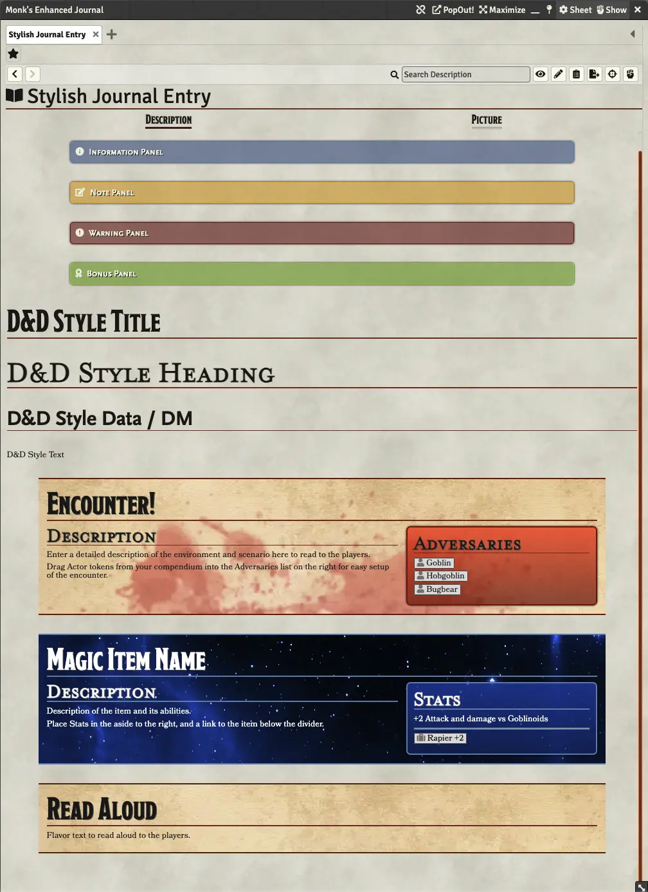

# Arius Planeswalker's Stylish Journal

   

Provides 4 alert banners, 4 text styles, and 3 pre-fromatted blocks for Encounters, Magic Items, and Read Aloud Descriptions.

## Installation

In the setup screen, use the URL `https://github.com/AmazingVanish/apsj/releases/latest/download/module.json` to install the module.

## Media

## License

Copyright © 2022 DreamScape Visionery, LLC. All rights reserved.

This package is under an [MIT license](LICENSE) and the [Foundry Virtual Tabletop Limited License Agreement for module development](https://foundryvtt.com/article/license/).

## Bugs

You can submit bugs via [Github Issues](https://github.com/AmazingVanish/apsj/issues/new/choose) or on [my Discord server](https://discord.gg/ge9GJXDsM2).

## Contact me

Come hang out on my [my Discord server](https://discord.gg/ge9GJXDsM2) or [click here to send me an email](mailto:chris.vancleve@dscape-llc.com?subject=Arius%20Planeswalker's%20Stylish%20Journal%20module%20for%20Foundry%20VTT).
